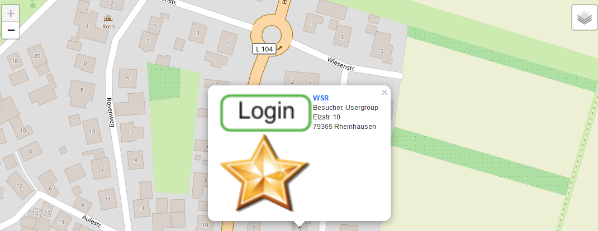

.. ==================================================
.. FOR YOUR INFORMATION
.. --------------------------------------------------
.. -*- coding: utf-8 -*- with BOM.

.. include:: ../Includes.txt

What does it do?
================

The extension enables you to show fe_users locations in responsive Leaflet maps. There are no registration and no API-keys necessary!
You can do a radial search for locations and display them in a list and a responsive Leaflet map with infoWindows.

For the geocoding, the extension uses https://nominatim.openstreetmap.org which is limited to 1 request per second. This may
change in the future...

A single view of the fe_user is implemented which shows just some details.

What's new?
^^^^^^^^^^^

Marker icon sizes can be set with the constant editor.
Categories are sorted by field sorting.
Localization of catgories and tt_address records implemented.
Mapicon handling changed. The directories fileadmin/ext/feusersmap/Resources/Public/Icons are created if they don't exist.
Insert here your mapIcons. These icons can then be selected in the fe_groups record (mapicon).

Screenshots
^^^^^^^^^^^

**Feusersmap (Map) result** 

.. image:: ../Images/Introduction/mapSearch.png
	:width: 500px
	:alt: Map View

   

	
