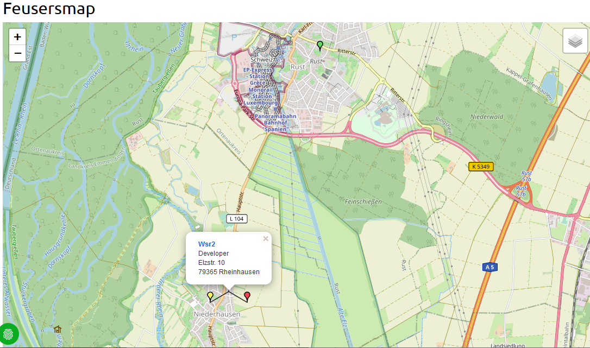

# feusersmap

#### Openstreetmap for your TYPO3 website and fe_users

What does it do
---------------

Openstreetmaps with radial search and fe_groups.
Show the results in responsive maps.

#### Plugin map

For details see [Introduction](https://github.com/joachimruhs/feusersmap/blob/master/Documentation/Introduction/Index.rst "Introduction")

For configuration and installation in detail, see the [Administrator Manual](https://github.com/joachimruhs/feusersmap/blob/master/Documentation/AdministratorManual/Index.rst "Administrator Manual")

